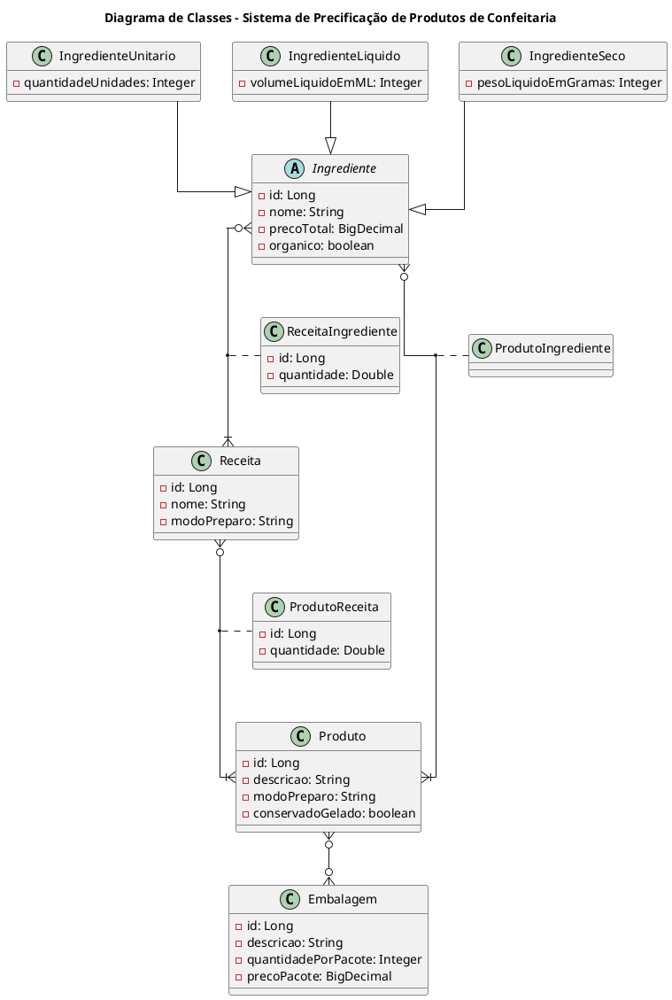

# Introdução
Este projeto faz parte da disciplina de Arquitetura Java. o sistema tem como principal objetivo a precificação de produtos de confeitaria, onde o usuário poderá cadastrar produtos, embalagens, receitas e ingredientes, além de visualizar os dados cadastrados.

# Definições

## Produto
Produto final, após todas as etapas de processamento. Pode conter:
- Receitas (que podem ter formas de preparo diferentes) e suas quantidades
- Embalagens (pode ser uma ou mais, por exemplo quanto se faz kits) e suas quantidades
- Ingredientes (podem ser acrescentados na finalização do produto) e suas quantidades
- Descrição (breve descrição do produto finalizado - para venda)
- Modo de preparo (descrição da etapa final de montagem e embalagem do produto)

## Embalagens
Insumos destinados ao transporte e à conservação do produto final, por exemplo, uma Caixa display de acetato 20x20x10cm ou um papel celofane transparente para embalar fatias de bolo.
Embalagens geralmente não são compradas sozinhas, mas em pacotes fechados com muitas unidades.

>***OBS: O preços das embalagens será calculado pela divisão do preço do pacote, pela quantidade de unidades no pacote***

## Receita
Etapa intermediária do processo de confecção do produto. Nesta etapa, as partes que irão compor o produto são descritas separadamente, por exemplo, em um bolo temos pelo menos três receitas:
1. Massa de bolo
2. Recheio
3. Cobertura

Cada um desses itens pode ser considerado uma receita diferente, pois tem ingredientes e modos de preparo diferentes. Porém todos irão compor o produto "Bolo" que, por fim, terá sua embalagem definida para venda ao consumidor final

## Ingrediente
Insumos para produção de receitas e finalização de produtos. 
No nosso sistema, os ingredientes podem ser de três tipos:

### Ingrediente Seco
Ingrediente que tem sua medida definida por peso (em gramas).
>**OBS: O preço por unidade será definido dividindo o preço do ingrediente por seu peso líquido**
>
>ex: se 1kg (1000g) de farinha de trigo custa R$ 5,00, então o preço por grama será R$ 0,005

### Ingrediente Líquido
Ingrediente que tem sua medida definida por volume (em mililitros).
>**OBS: O preço por unidade será definido dividindo o preço do ingrediente por seu volume líquido**
>
>ex: se 1L (1000ml) de leite custa R$ 6,00, então o preço por mililitro será R$ 0,006

### Ingrediente Unitário
Ingrediente que tem sua medida definida por unidade.
>**OBS: O preço por unidade será definido dividindo o preço do lote por pela quandidade de unidades**
>
>ex: se uma dúzia de ovos custa R$ 10,00, então o preço por unidade será R$ 0,83

# Requisitos de projeto

## FEATURE 01
A primeira feature estabelece a base do sistema de precificação de produtos de confeitaria, criando as classes de domínio, definindo atributos, relacionamentos e implementando funcionalidades essenciais para a leitura de dados a partir de arquivos textos e operações de inclusão e recuperação de informações por meio das classes de serviço. Essa é a etapa inicial crucial para o desenvolvimento do software, que servirá como alicerce para as futuras funcionalidades do sistema. Essa feature do projeto visa estabelecer os alicerces do sistema de precificação de produtos de confeitaria, construindo as principais estruturas de domínio e funcionalidades necessárias para o seu funcionamento inicial. Esta feature abrange as seguintes tarefas:

- [x] Criação das quatro classes de domínio de acordo com o diagrama
	- Produto (classe principal)
	- Embalagem
	- Receita
	- Ingrediente
		- Ingrediente seco
		- Ingrediente líquido

`Gerar diagrama de classes`

- [x] Criação de pelo menos dois atributos por classe: cada uma das quatro classes deve ser dotada de, no mínimo, dois atributos que representam informações relevantes para a entidade em questão. Os atributos existentes no diagrama podem ser considerados mas também existe a possibilidade da definição de novos.

- [ ] Implementar os relacionamentos entre as classes: estabelecer os relacionamentos entre as classes é essencial para a integridade das informações no sistema. Os relacionamentos podem ser de diferentes tipos, como "um para um", "um para muitos" ou "muitos para muitos", conforme a necessidade de representar a associação entre as entidades.

- [ ] Utilizar os quatro tipos de dados fundamentais: as classes devem empregar os quatro tipos de dados fundamentais: caractere (String), inteiro (int), real (float/double) e lógico (boolean), conforme necessário para representar os atributos e informações das classes do projeto.

- [ ] Criar classes Loader para realizar a leitura de arquivos textos e popular os objetos: para facilitar a inicialização e preenchimento dos objetos a partir de dados externos, como arquivos de texto, é necessário criar classes Loader. Essas classes serão responsáveis por ler os dados desses arquivos e transformá-los em instâncias das classes de domínio.

- [ ] Criar arquivos textos com as informações de cada classe com os campos separados por ";": deve ser criado um conjunto de arquivos de texto que contenham informações relevantes para cada classe, com os campos separados por um caractere delimitador, como o ponto e vírgula. Esses arquivos servirão como fonte de dados para o sistema.

- [ ] Criar as classes @Service com os métodos "incluir" e "obterLista": para gerenciar as operações relacionadas às classes de domínio, como a inclusão de novos registros e a recuperação de listas de objetos, é preciso criar as classes de serviço (annotated com @Service) correspondentes a cada classe de domínio. Essas classes conterão os métodos "incluir" e "obterLista" para a manipulação dos dados.
>Estes métodos devem guardar e recuperar as informações do Map: os métodos "incluir" e "obterLista" das classes @Service devem interagir com uma estrutura de dados, como um Map, para armazenar e recuperar as informações das classes de domínio. Isso permitirá o acesso eficiente e a manipulação dos dados do sistema.

## FEATURE 02
A segunda feature é essencial para a consolidação do sistema, pois estabelece uma base de dados sólida, configura relacionamentos importantes entre as entidades e prepara o sistema para operações avançadas, como consultas complexas e a manutenção eficiente de dados. Isso permite ao sistema de precificação de produtos de confeitaria gerenciar informações de maneira mais escalável e eficaz. Essa segunda feature do projeto concentra-se em estabelecer uma infraestrutura de banco de dados robusta para o sistema de precificação de produtos de confeitaria. Ela abrange as seguintes tarefas essenciais:

Criação do banco de dados e configuração do datasource para acesso e manipulação: inicialmente, um banco de dados será criado e configurado para possibilitar o armazenamento e a recuperação de dados do sistema. Isso envolve a escolha de um sistema de gerenciamento de banco de dados (DBMS), como MySQL, PostgreSQL ou outro, e a configuração de um datasource para permitir a comunicação com o banco.
Mapeamento das classes de domínio em entidades do banco: as classes de domínio criadas na primeira feature serão mapeadas em entidades do banco de dados. Isso implica em definir como os atributos de cada classe correspondem às colunas do banco e como os relacionamentos entre as entidades serão refletidos no esquema do banco de dados.
Criar o relacionamento oneToMany entre as entidades de vendedor e de produto: será estabelecido um relacionamento "one-to-many" entre as entidades de "vendedor" e "produto". Isso significa que um vendedor pode estar associado a vários produtos, enquanto um produto pertence a apenas um vendedor.
Criar o relacionamento de herança entre a classe de produto e as suas filhas: para lidar com diferentes tipos de produtos (por exemplo, produtos físicos e produtos digitais), será estabelecido um relacionamento de herança entre a classe "Produto" e suas subclasses. Isso permite que as características específicas de cada tipo de produto sejam modeladas de forma eficiente.
Criação das interfaces @Repository para possibilitar o uso das funcionalidades de banco de dados da CrudRepository: serão criadas interfaces anotadas com @Repository para as entidades do banco de dados. Essas interfaces estenderão a CrudRepository, proporcionando operações de CRUD (Create, Read, Update, Delete) padrão para as entidades.
Atuar na injeção de dependência dos repositories nas classes de serviço: os repositórios criados na etapa anterior serão injetados nas classes de serviço correspondentes. Isso permitirá que as classes de serviço acessem o banco de dados de maneira eficiente, implementando as operações de negócios relacionadas a cada entidade.
Desconsiderar a estrutura Map após a realização da injeção de dependência dos repositories: após a injeção de dependência dos repositories, a estrutura de dados Map, usada na primeira feature para simular o armazenamento temporário, pode ser desconsiderada. As operações de armazenamento e recuperação de dados agora serão realizadas diretamente no banco de dados.
Atualizar as classes Loader para relacionar os produtos cadastrados com os vendedores existentes: as classes Loader criadas na primeira feature precisam ser atualizadas para preencher o banco de dados com dados relacionados. Isso envolve associar os produtos cadastrados aos vendedores existentes por meio dos relacionamentos definidos.

## FEATURE 03
A terceira feature tem como objetivo melhorar a usabilidade da aplicação, permitindo que os usuários vejam os dados de forma organizada e compreensível, ao mesmo tempo em que se concentra na qualidade dos dados, validando e tratando exceções durante o processo. A integração com a API de CEP adiciona valor ao fornecer informações geográficas úteis para os registros dos vendedores. Certifique-se de que a interface do usuário seja amigável e intuitiva para os usuários finais.

Essa terceira feature do projeto envolve a criação de recursos de frontend e controle que permitirão a visualização dos dados armazenados nas quatro tabelas do banco de dados, juntamente com informações relevantes. Abaixo estão os principais requisitos e atividades a serem entregues nesta feature:

Tela de Visualização de Dados: crie uma interface de usuário utilizando tecnologias como JSP ou outra proposta de frontend para exibir os dados das quatro tabelas do banco de dados. Isso permitirá que os usuários visualizem os registros de forma amigável.
Visualização da Quantidade de Registros: além de exibir os dados, implemente a funcionalidade para mostrar a quantidade de registros existentes em cada uma das quatro tabelas. Isso fornece uma visão geral do tamanho de cada conjunto de dados.
Classe de Controle Única: crie uma classe de controle única que atuará como um ponto central para a navegação na aplicação. Esta classe deve conter rotas para acessar a tela de visualização e outras quatro rotas para recuperar os dados de cada uma das tabelas.
Validações de Dados: implemente validações de dados para garantir a integridade e a qualidade dos dados inseridos. Use anotações como @Size, @Pattern, @Positive, @PositiveOrZero, @NotNull, @Unique, @Default e outras, conforme necessário, para validar os campos das tabelas.
Tratamento de Exceções: atualize as classes de carga de dados (Loaders) para possibilitar o tratamento de exceções durante a inclusão de registros no banco de dados. Isso ajuda a lidar com erros de forma adequada e manter a integridade dos dados.
Classes de Controle para Exclusão: crie classes de controle separadas para implementar rotas de exclusão de registros. Isso permitirá que os usuários removam dados das tabelas de maneira controlada.
Classe para Representar o CEP do Vendedor: crie uma classe dedicada para representar o CEP do vendedor. Essa classe deve conter os campos e métodos necessários para armazenar e manipular informações de CEP.
Consumo da API de CEP: integre uma API de consulta de CEP para recuperar informações com base no número do CEP informado. Atualize os dados obtidos da API no banco de dados, associando-os aos registros dos vendedores. Isso permitirá que os dados de CEP estejam disponíveis para visualização na tela.

## FEATURE 04
A quarta feature do projeto abrange melhorias significativas na interação com dados, organização e integração por meio do ajuste do processo de exclusão, ordenação mais flexível, busca unificada e a introdução de uma API para manipulação eficiente das informações.

Essa feature visa proporcionar uma experiência mais completa e eficiente aos usuários, permitindo uma interação mais avançada com os dados, organização personalizada e uma integração mais robusta entre o frontend e a API.

Certifique-se de realizar testes abrangentes para garantir a estabilidade e a eficácia das novas funcionalidades. Abaixo estão os principais requisitos e atividades a serem entregues nesta feature:

Ajuste do Processo de Exclusão: aprimore o processo de exclusão para evitar informações órfãs no relacionamento entre vendedores e produtos. Isso garante a consistência referencial no banco de dados, mantendo a integridade dos dados..
Organização da Ordenação das Informações: implemente uma funcionalidade que permita a organização personalizada das informações nos cadastros. Cada contexto, como vendedores, produtos, etc., deve ter seu critério de ordenação específico, proporcionando flexibilidade aos usuários.
Busca Unificada: integre uma funcionalidade de busca unificada que permita aos usuários procurar informações em todos os cadastros a partir da tela principal do projeto. Isso melhora a usabilidade e facilita o acesso rápido aos dados desejados.
Criação de API para Cadastro de Informações: desenvolva uma API para cadastrar informações no projeto. Os endpoints "incluir" e "excluir" devem ser criados, possibilitando a manipulação eficiente dos dados por meio dessa interface.
Atualização do Projeto Web para Consumir a API: faça as devidas atualizações no projeto web para integrar e consumir os novos endpoints da API. Certifique-se de que a comunicação entre o frontend e o backend seja eficaz e que as operações de inclusão e exclusão sejam refletidas corretamente na interface do usuário.
Atualização da Tela Home para Apresentar Informações da API: modifique a tela inicial (home) para apresentar as informações provenientes da API. Isso pode incluir a exibição de dados cadastrados, estatísticas ou qualquer outra informação relevante obtida por meio dos novos endpoints.
Novos Endpoints na API: expanda a API para incluir novos endpoints além do "obterLista". Implemente os endpoints "incluir" e "excluir" para permitir operações completas de CRUD (criação, leitura, atualização e exclusão) por meio da API.
Atualização da API para Suportar Novos Endpoints: atualize a API para garantir que ela esteja configurada corretamente e suporte os novos endpoints "incluir" e "excluir". Certifique-se de que a autenticação, validação e demais aspectos de segurança estejam adequadamente implementados.
ENTREGA
Para garantir a entrega organizada e rastreável do projeto de desenvolvimento do software de precificação de produtos de confeitaria, é importante seguir um procedimento claro e documentado. Isso pode ser feito através do GitHub do aluno, seguindo as etapas a seguir:

Criação de um Repositório no GitHub: o aluno deve criar um repositório no GitHub onde todo o código-fonte e a documentação relacionada ao projeto serão armazenados.
Estrutura de Diretórios do Repositório: no repositório do GitHub, o aluno deve organizar os arquivos de acordo com uma estrutura de diretórios apropriada. Uma estrutura típica pode incluir subdiretórios para código-fonte, documentação, recursos, etc.

Criação de um Arquivo PDF de Documentação: o aluno deve criar um arquivo PDF que conterá informações importantes sobre o projeto. Esse arquivo deve incluir:
1. Informações da Instituição
2. Informações do Curso
3. Informações da Disciplina
4. Nome do Professor
5. Nome do Aluno
6. Resumo do Projeto
7. Procedimentos de Entrega: instruções claras sobre como o projeto deve ser acessado e avaliado.

README do Repositório: o aluno também pode criar um arquivo README.md no repositório do GitHub para fornecer informações adicionais sobre o projeto, como uma breve visão geral, requisitos de configuração e execução, e quaisquer outras informações relevantes.
Atualização e Manutenção do Repositório: é importante manter o repositório atualizado ao longo do desenvolvimento do projeto, fazendo commits regulares à medida que novas funcionalidades são adicionadas ou problemas são corrigidos.
Entrega e Compartilhamento: o link para o repositório do GitHub, juntamente com o arquivo PDF de documentação, deve ser compartilhado com o professor ou avaliador, garantindo que eles tenham acesso fácil ao projeto e às informações necessárias para avaliação.
Essa abordagem permite uma entrega organizada e documentada do projeto, facilitando a avaliação por parte do professor e a rastreabilidade do desenvolvimento ao longo do tempo. Além disso, o GitHub oferece recursos de controle de versão que podem ser úteis durante o processo de desenvolvimento. Certifique-se de seguir as diretrizes específicas da instituição e do professor, caso haja requisitos adicionais.